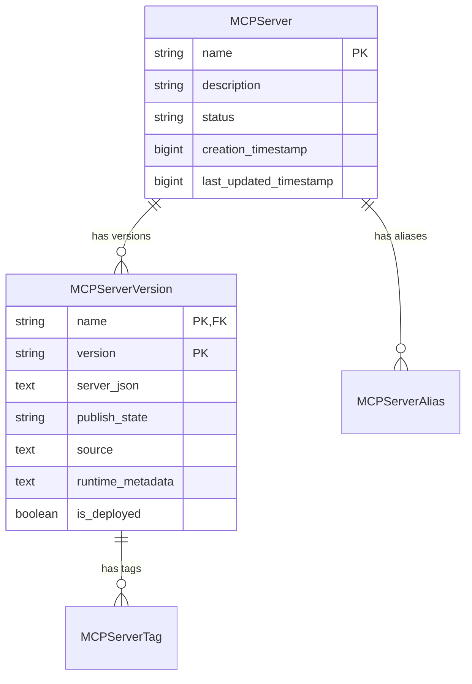
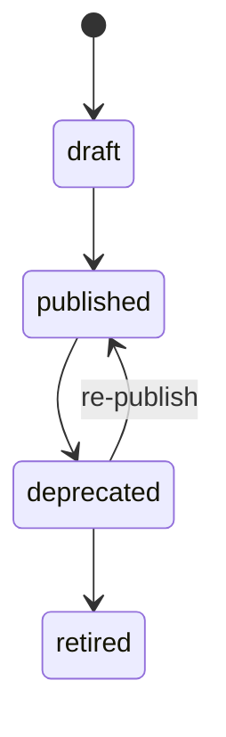

start_date:   2026-04-17
mlflow_issue: [22625](https://github.com/mlflow/mlflow/issues/22625)
rfc_pr:

# Summary

Add first-class support for registering MCP (Model Context Protocol) servers as governed, versioned assets in MLflow. This introduces two new entity types — `MCPServer` and `MCPServerVersion` — along with a REST API, Python client, and UI surface that follow the patterns established by the existing Skill Registry.

Each `MCPServerVersion` carries an immutable [`server.json`](https://registry.modelcontextprotocol.io/docs#/schemas/ServerJSON) payload as its canonical MCP definition, with MLflow-managed metadata (publish state, tags, deployment references) alongside it.

# Basic example

```python
import mlflow

client = mlflow.MlflowClient()

# Register a new MCP server
client.create_mcp_server(name="github-mcp", description="GitHub API operations")

# Create a version with the canonical server.json payload
client.create_mcp_server_version(
    name="github-mcp",
    version="1.0.0",
    server_json={
        "name": "github-mcp",
        "description": "MCP server for GitHub API operations",
        "repository": {"url": "https://github.com/modelcontextprotocol/servers"},
        "remotes": [{"transportType": "streamable-http", "url": "https://mcp.example.com/github"}],
    },
)

# Publish the version
client.update_mcp_server_version(
    name="github-mcp", version="1.0.0", publish_state="published"
)

# Query published servers
servers = client.search_mcp_servers(filter_string="publish_state = 'published'")
```

## Motivation

MLflow manages versioned AI assets — models, prompts, skills. MCP servers are a missing asset type. Organizations building with MCP need a way to register servers (internal and external), track versions, control what's published, and expose a governed source of truth for downstream consumers like catalogs, gateways, and AI development tools.

Today this requires stitching together external systems. There is no first-class MLflow concept for an MCP server as a versioned, governed asset.

### Out of scope

- MCP runtime hosting or deployment orchestration
- Gateway policy enforcement or automated gateway registration
- Approval workflows or review gates
- Certification or verification status tracking
- Tool execution or MCP protocol proxying

## Detailed design

### Entity model

Two core entities, following the Skill Registry pattern:

**MCPServer** — the logical governed asset, scoped to a workspace.

| Field | Type | Notes |
|-------|------|-------|
| `name` | `str` | Primary key within workspace |
| `description` | `str?` | Mutable registry summary |
| `status` | `active \| deprecated \| retired` | Server-level lifecycle, default `active` |
| `tags` | `list[MCPServerTag]` | Key-value search metadata |
| `aliases` | `list[MCPServerAlias]` | Stable version pointers (e.g. `@current`) |
| `last_registered_version` | `str?` | Most recently created version |
| `created_by`, `last_updated_by` | `str?` | Audit |
| `creation_timestamp`, `last_updated_timestamp` | `int?` | Epoch millis |

**MCPServerVersion** — immutable MCP payload + mutable MLflow metadata.

| Field | Type | Notes |
|-------|------|-------|
| `name` | `str` | Parent server name |
| `version` | `str` | Publisher-supplied (semver recommended, not enforced) |
| `server_json` | `JSON text` | Canonical immutable MCP payload |
| `publish_state` | `draft \| published \| deprecated \| retired` | Controls downstream surfacing, default `draft` |
| `source` | `str?` | Provenance (URL, path, etc.) |
| `run_id` | `str?` | Optional MLflow run linkage |
| `tags` | `list[MCPServerTag]` | Version-specific metadata |
| `runtime_metadata` | `dict[str, str]` | Loose deployment refs (endpoint URLs, deployment IDs) |
| `is_deployed` | `bool` | Whether runtime metadata exists, default `false` |
| `created_by`, `last_updated_by` | `str?` | Audit |
| `creation_timestamp`, `last_updated_timestamp` | `int?` | Epoch millis |

Supporting types:

```python
class MCPServerTag:
    key: str
    value: str

class MCPServerAlias:
    alias: str       # e.g. "current", "stable"
    version: str     # target version string
```

Key difference from the Skill Registry: versions use publisher-supplied strings (not auto-increment integers) because MCP servers are external assets with their own versioning.

### Entity relationship



### Database schema

Four tables, following the skill registry migration pattern:

```python
# registered_mcp_servers
sa.Column("name", sa.String(255), nullable=False)          # PK
sa.Column("description", sa.Text(), nullable=True)
sa.Column("status", sa.String(32), nullable=False, default="active")
sa.Column("creation_timestamp", sa.BigInteger())
sa.Column("last_updated_timestamp", sa.BigInteger())

# mcp_server_versions
sa.Column("name", sa.String(255), nullable=False)          # PK, FK -> registered_mcp_servers
sa.Column("version", sa.String(255), nullable=False)       # PK
sa.Column("server_json", sa.Text(), nullable=False)        # canonical MCP payload
sa.Column("publish_state", sa.String(32), default="draft")
sa.Column("source", sa.Text(), nullable=True)
sa.Column("run_id", sa.String(255), nullable=True)
sa.Column("runtime_metadata", sa.Text(), nullable=True)    # JSON-encoded dict
sa.Column("is_deployed", sa.Boolean(), default=False)
sa.Column("creation_timestamp", sa.BigInteger())
sa.Column("last_updated_timestamp", sa.BigInteger())

# mcp_server_version_tags
sa.Column("name", sa.String(255), nullable=False)          # PK, FK -> mcp_server_versions
sa.Column("version", sa.String(255), nullable=False)       # PK, FK -> mcp_server_versions
sa.Column("key", sa.String(255), nullable=False)           # PK
sa.Column("value", sa.String(5000), nullable=True)

# mcp_server_aliases
sa.Column("name", sa.String(255), nullable=False)          # PK, FK -> registered_mcp_servers
sa.Column("alias", sa.String(255), nullable=False)         # PK
sa.Column("version", sa.String(255), nullable=False)
```

`server_json` is stored as `Text`, not a database-native `JSON` column, for portability across SQLite, PostgreSQL, and MySQL. Validation happens at the API layer before persistence.

`runtime_metadata` is also stored as `Text` (JSON-encoded dict) for the same reason.

### REST API

Router prefix: `/ajax-api/3.0/mlflow/mcp-servers`

| Method | Path | Description |
|--------|------|-------------|
| POST | `/` | Create a new MCP server |
| GET | `/` | List/search MCP servers (filterable by name, status, publish state) |
| GET | `/{name}` | Get server details + all versions |
| DELETE | `/{name}` | Delete a server and all versions |
| POST | `/{name}/versions` | Create a new version with `server_json` |
| GET | `/{name}/versions/{version}` | Get a specific version |
| PATCH | `/{name}/versions/{version}` | Update mutable fields (publish_state, runtime_metadata) |
| DELETE | `/{name}/versions/{version}` | Delete a version |
| POST | `/{name}/versions/{version}/tags` | Set a tag |
| DELETE | `/{name}/versions/{version}/tags/{key}` | Delete a tag |
| POST | `/{name}/aliases` | Create/update an alias |
| DELETE | `/{name}/aliases/{alias}` | Delete an alias |

### Python client API

```python
class MlflowClient:
    def create_mcp_server(self, name: str, description: str | None = None) -> MCPServer: ...
    def get_mcp_server(self, name: str) -> MCPServer: ...
    def search_mcp_servers(self, filter_string: str | None = None, max_results: int = 100) -> list[MCPServer]: ...
    def delete_mcp_server(self, name: str) -> None: ...

    def create_mcp_server_version(self, name: str, version: str, server_json: dict, source: str | None = None, run_id: str | None = None) -> MCPServerVersion: ...
    def get_mcp_server_version(self, name: str, version: str) -> MCPServerVersion: ...
    def update_mcp_server_version(self, name: str, version: str, publish_state: str | None = None, runtime_metadata: dict[str, str] | None = None) -> MCPServerVersion: ...
    def delete_mcp_server_version(self, name: str, version: str) -> None: ...

    def set_mcp_server_version_tag(self, name: str, version: str, key: str, value: str) -> None: ...
    def delete_mcp_server_version_tag(self, name: str, version: str, key: str) -> None: ...

    def set_mcp_server_alias(self, name: str, alias: str, version: str) -> None: ...
    def delete_mcp_server_alias(self, name: str, alias: str) -> None: ...
```

### `server_json` handling

`server_json` is the canonical MCP payload, aligned with the upstream [ServerJSON schema](https://registry.modelcontextprotocol.io/docs#/schemas/ServerJSON). It is:

- **Immutable after creation** — enforced at the API/store layer, not by Python dataclass freezing
- **Validated on write** — must be valid JSON and pass basic structural validation (required top-level fields per upstream schema)
- **Stored as text** — the raw JSON string in a `Text` column
- **Projected with convenience properties** — `title`, `description`, `package_types`, `transport_types`, `has_packages`, `has_remotes` are derived from `server_json` at read time, not stored separately

### Publish state machine



All versions start as `draft`. Only `published` versions are eligible for downstream surfacing. Deprecated versions remain queryable. Transitions are recorded via `last_updated_timestamp` and `last_updated_by`.

## Drawbacks

- New entity type adds surface area to MLflow's data model and API
- `server_json` schema evolution is upstream-dependent — MLflow must track changes to the MCP registry schema
- Implementation spans all layers: database, store, API, client, CLI, and frontend

# Alternatives

**Use Model Registry with tags.** MCP servers could be modeled as registered models with MCP-specific tags. This avoids new entity types but loses type safety, makes `server_json` a second-class blob in tags, and prevents meaningful filtering on MCP-specific fields like publish state. The Skill Registry faced the same choice and chose dedicated entities.

**External registry.** Keep MCP registration outside MLflow entirely. This avoids MLflow changes but fragments the governed asset story — users would need a separate system for MCP servers while using MLflow for everything else. MLflow's existing asset management patterns (versioning, tagging, aliasing) would have to be re-implemented.

# Adoption strategy

This is an additive, non-breaking change. No existing APIs or entities are modified.

Suggested rollout: (1) entity model + database migration + store layer, (2) REST API + Python client, (3) CLI commands, (4) frontend UI. The feature can be gated behind an experimental flag during initial development.

# Open questions

ToDo